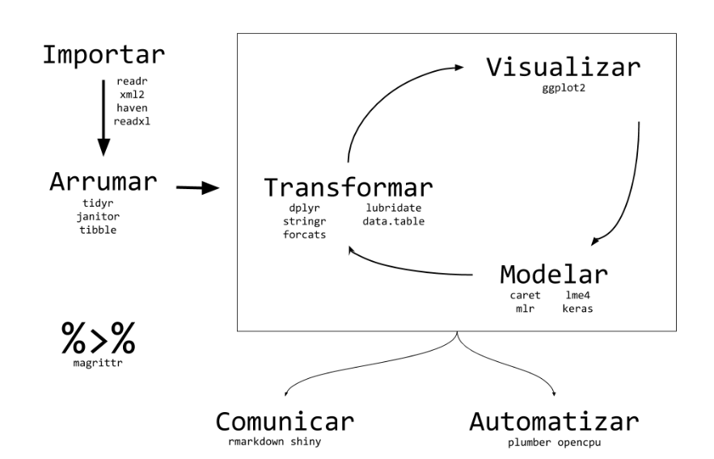

<!-- ```{r, echo=FALSE} -->

<!-- htmltools::img(src = knitr::image_uri("C:/Users/Leonardo_Nascimento/Documents/GitHub/Introducao_Ciencias_de_Dados/Cadernos/Figuras/DE.jpg"), -->

<!--                alt = 'logo', -->

<!--                 width = 180, height = 180, -->

<!--                style = 'position:absolute; top:10px; right:400px; padding:10px;') -->

<!-- ``` -->

<!-- ```{r, echo=FALSE} -->

<!-- htmltools::img(src = knitr::image_uri("C:/Users/Leonardo_Nascimento/Documents/GitHub/Introducao_Ciencias_de_Dados/Cadernos/Figuras/ufam.png"), -->

<!--                alt = 'logo', -->

<!--                width = 180, height = 180, -->

<!--                style = 'position:absolute; top:10px; left:400px; padding:10px; "margin: -100px;') -->

<!-- ``` -->

<!-- ```{css, echo=FALSE} -->

<!-- .watch-out { -->

<!--   border: 3px solid gray; -->

<!--   font-weight: bold; -->

<!-- } -->

<!-- ``` -->

```{r setup, include = FALSE}

knitr::opts_chunk$set(
 
  collapse = TRUE,

  comment  = "#>",

  class.source = "watch-out",

  fig.height = 10,

  fig.width = 10,

  fig.align = "center"

)

require(tidyverse)
require(dplyr)
```

# Tidyverse

-   O **`tidyverse`** é um conjunto integrado de pacotes R desenvolvidos para facilitar a manipulação, visualização e análise de dados de forma consistente e eficiente.

-   O **`tidyverse`** é composto por vários pacotes, sendo os principais:

    1.  **`ggplot2`:** Um pacote poderoso para criação de gráficos baseados na gramática de gráficos. Ele permite criar visualizações complexas e esteticamente agradáveis com uma sintaxe declarativa.

    2.  **`dplyr`:** Oferece funções para manipulação eficiente de dados, facilitando a filtragem, seleção, agrupamento, ordenação e resumo de conjuntos de dados.

    3.  **`tidyr`:** Fornecer ferramentas para manipulação de dados para torná-los "tidy". Isso inclui funções para espalhar (spread) e juntar (gather) dados, entre outras operações de reformatar.

    4.  **`tibble`:** Introduz o conceito de tibble, uma versão moderna de data frames, mais eficiente e fácil de usar, seguindo os princípios de dados "tidy".

    5.  **`readr`:** Oferece funções rápidas e eficientes para ler dados retos em R. Ele é projetado para ser mais rápido que as funções base do R, como **`read.csv`**.

    6.  **`purrr`:** Facilita a aplicação de funções em listas e vetores, proporcionando uma abordagem mais consistente e funcional para operações em dados.

    7.  **`stringr`:** Fornece funções para manipulação de strings de uma maneira mais intuitiva e consistente do que as funções base do R.

    8.  **`forcats`:** Especializado na manipulação de fatores, permitindo ajustar facilmente os níveis e rótulos dos fatores.

-   Para carregar todos esses pacotes utilize `library(tidyverse)` 

{width="584"}

# Pacote `forcats`

-   Os fatores em R são usados para representar variáveis categóricas, como grupos, categorias ou níveis.

-   Os fatores também são úteis para reordenar vetores de caracteres para melhorar a exibição.

-   O pacote **`forcats`** fornece funções para manipular eficientemente fatores, incluindo a reordenação de níveis, renomeação de níveis, criação de fatores ordenados e não ordenados, entre outros.

## Fatores X Strings

-   Imagine que você tem uma variável que registra o mês:

```{r}
x1 <- c("Dec", "Apr", "Jan", "Mar")
typeof(x1)
```

-   Usar uma string para registrar esta variável tem dois problemas:

    -   Existem apenas doze meses possíveis e não há nada que o salve de erros de digitação:

        ```{r}
        x2 <- c("Dec", "Apr", "Jam", "Mar")
        ```

    -   Não classifica de maneira útil:

        ```{r}
        sort(x1)
        ```

<!-- -->

-   Você pode corrigir esses dois problemas utilizando **fator.** Para criar um fator você deve começar criando uma lista dos **níveis** válidos

```{r}
(month_levels = month.abb)
(y1 <- factor(x1, levels = month_levels))
sort(y1)
levels(y1)
```

-   Se você omitir os níveis, eles serão ordenados em ordem alfabética:

```{r}
factor(x1)
```

-   Quaisquer valores que não estejam no nível serão convertidos para NA:

```{r}
y2 <- factor(x2, levels = month_levels)
y2
```

## `Função fct()`

-   Utilizando a função `forcats::fct` para criar fatores

```{r}
forcats::fct(x1)
forcats::fct(x1, levels = month_levels)
```

```{r eval=F}
forcats::fct(x2,levels = month_levels)

Error in `forcats::fct()`:
! All values of `x` must appear in `levels` or `na`
ℹ Missing level: "Jam"
```

## Reordenamento de níveis - `fct_relevel`

```{r}
# Criando um fator com os meses 
meses_ordenados = factor(month.abb,levels = month.abb)
meses_ordenados
# Reordenando os níveis para iniciar com "Domingo"
meses_reordenados <- fct_relevel(meses_ordenados, "Dec")
meses_reordenados
```

## Reordenamento de níveis - `fct_infreq()`

-   A função `forcats::fct_infreq()` permite reordenar o atributo `levels` de acordo com a frequência em que cada nível aparece no vetor (do nível mais frequente para o menos frequente).

```{r}
frutas <- factor(c("Maçã", "Banana", "Laranja", "Pera", "Uva", "Banana", "Banana", "Laranja", "Maçã", "Maçã"))

# Reordenando os níveis com base na frequência
frutas_reordenadas <- forcats::fct_infreq(frutas)

# Verificando os níveis reordenados
levels(frutas_reordenadas)
table(frutas)
```

## Reordenamento de níveis - `fct_inorder()`

-   Ordenar os níveis de um fator de acordo com a ordem da primeira aparição de cada nível

```{r}
frutas <- factor(c("Maçã", "Banana", "Laranja", "Pera", "Uva", "Banana", "Banana", "Laranja", "Maçã", "Maçã"))

forcats::fct_inorder(frutas)

```

## Reordenamento de níveis - `fct_reorder()`

-   Ordenar os níveis de seu fator de acordo com uma segunda variável.

```{r}
library(forcats)

# Exemplo de dados com nomes de países e suas populações
paises <- c("Brasil", "China", "Estados Unidos", "Índia", "Indonésia")
populacao <- c(10, 50, 30, 40, 20)
factor(paises)
# Criando um fator ordenado com os países, ordenados pela população
paises_ord <- forcats::fct_reorder(factor(paises), populacao)
paises_ord
# Plotando um gráfico de barras da população dos países
barplot(sort(populacao), names.arg = levels(paises_ord), xlab = "País", ylab = "População", main = "População dos Países")

```

-   Ordenando através de uma estatística

```{r}

produtos <- c("Produto A", "Produto B", "Produto C", "Produto D")
vendas <- c(1500, 2000, 1200, 1800)  # Total de vendas por produto
regiao <- c("Norte", "Sul", "Leste", "Oeste")  # Regiões fictícias
produto_regiao <- expand.grid(Produto = produtos, Regiao = regiao)
produto_regiao$Vendas <- sample(vendas, nrow(produto_regiao), replace = TRUE)

produto_regiao
factor(produtos)

produto_regiao %>%  
  mutate(teste_fact = forcats::fct_reorder(factor(Produto),Vendas,.fun = mean,.desc = F)) %>% pull(teste_fact) %>% levels()

```

-   Note que ele ordenou pela média de vendas

```{r}
produto_regiao %>% 
  group_by(Produto) %>% 
  summarise(md = mean(Vendas)) %>% 
  arrange(md)
```

## Modificando os níveis de um fator

-   A função **`forcats::fct_recode()`** é utilizada para renomear ou recodificar os níveis de um fator de acordo com um novo conjunto de valores.

-   Isso é útil quando você precisa alterar os rótulos dos níveis do fator para torná-los mais descritivos, agrupá-los ou simplificá-los.

```{r}
clima <- c("Ensolarado", "Chuvoso", "Nublado", "Ensolarado", "Chuvoso", "Nublado", "Chuvoso", "Nublado")

# Criando um fator com os dados do clima
clima_fator <- factor(clima)

# Recodificando os níveis do fator clima
clima_recodificado <- forcats::fct_recode(clima_fator,
                                           "Ensolarado/Parcialmente Ensolarado" = "Ensolarado",
                                           "Chuvoso/Chuva" = "Chuvoso",
                                           "Nublado/Nublado com Possibilidade de Chuva" = "Nublado")

# Verificando os níveis recodificados
levels(clima_recodificado)
```

# Referências

-   [R for Data Science](https://r4ds.hadley.nz/)

-   [Ciência de Dados em R](https://livro.curso-r.com/index.html)

-   [Tidyverse](https://www.tidyverse.org/packages/#installation-and-use)

-   [Introdução à Linguagem R: seus fundamentos e sua prática](https://pedropark99.github.io/Introducao_R/index.html)
