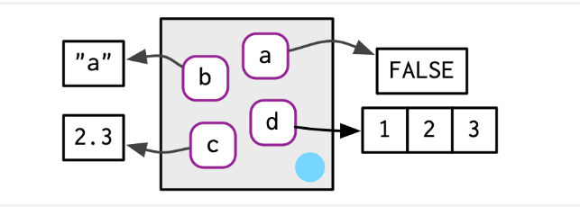
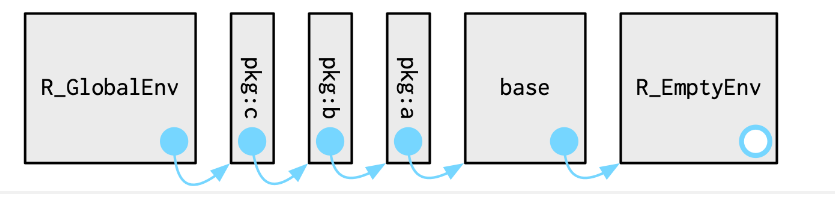
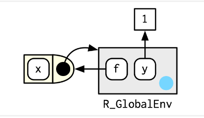
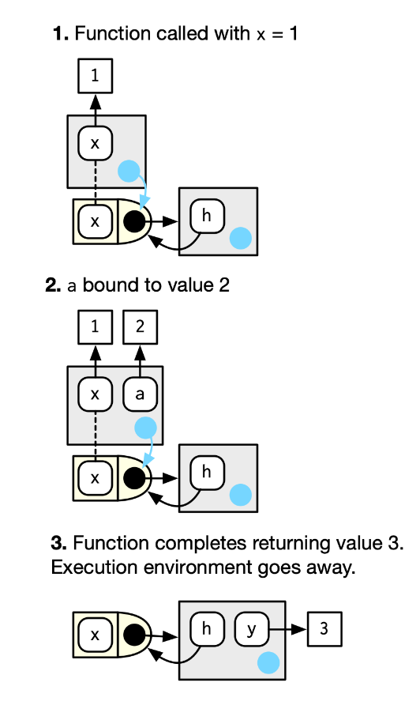
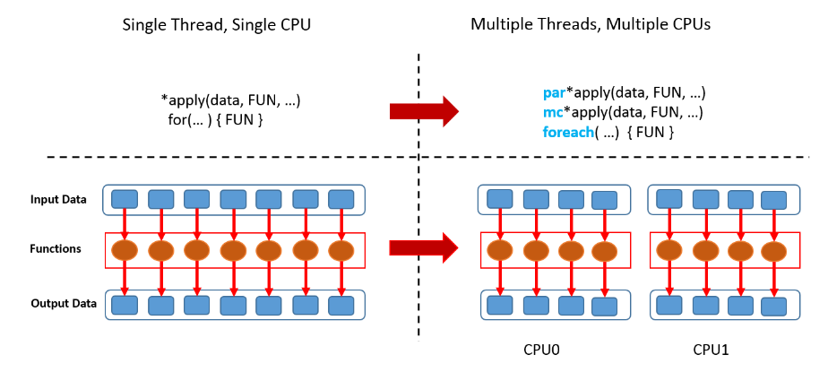

<!-- ```{r, echo=FALSE} -->

<!-- htmltools::img(src = knitr::image_uri("C:/Users/Leonardo_Nascimento/Documents/GitHub/Introducao_Ciencias_de_Dados/Cadernos/Figuras/DE.jpg"), -->

<!--                alt = 'logo', -->

<!--                 width = 180, height = 180, -->

<!--                style = 'position:absolute; top:10px; right:400px; padding:10px;') -->

<!-- ``` -->

<!-- ```{r, echo=FALSE} -->

<!-- htmltools::img(src = knitr::image_uri("C:/Users/Leonardo_Nascimento/Documents/GitHub/Introducao_Ciencias_de_Dados/Cadernos/Figuras/ufam.png"), -->

<!--                alt = 'logo', -->

<!--                width = 180, height = 180, -->

<!--                style = 'position:absolute; top:10px; left:400px; padding:10px; "margin: -100px;') -->

<!-- ``` -->

<!-- ```{css, echo=FALSE} -->

<!-- .watch-out { -->

<!--   border: 3px solid gray; -->

<!--   font-weight: bold; -->

<!-- } -->

<!-- ``` -->

<!-- ```{r setup, include = FALSE} -->

<!-- knitr::opts_chunk$set( -->

<!--   collapse = TRUE, -->

<!--   comment  = "#>", -->

<!--   class.source = "watch-out", -->

<!--   fig.height = 3,  -->

<!--   fig.width = 3,  -->

<!--   fig.align = "center" -->

<!-- ) -->

<!-- ``` -->

# Environments

## Conceitos iniciais

-   Ambientes (environments) em R são estruturas de dados que representam **espaços** onde objetos, como variáveis e funções, são associados a nomes.

-   Você pode pensar em um ambiente como um conjunto de nomes, sem ordem implícita.

{width="592"}

-   No exemplo abaixo, estamos criando uma associação do símbolo `nome` ao valor `Leonardo`, que, por padrão, é guardada dentro do *global environment*.

```{r}
nome <- "Leonardo"
ls(globalenv())
nome
```

-   Nesse caso, quando "chamarmos" o símbolo `nome` , o R vai procurar dentro desse *environment* um valor para devolver

-   É possível criar novos *environments* com a função `new.env()` ou `rlang::env()`

```{r}
novo_ambiente = new.env() # criando o ambiente
novo_ambiente$nome <- "Nascimento" #criando objeto dentro do ambiente ou
assign(nome,"Nascimento",envir = novo_ambiente ) #criando objeto dentro do ambiente
nome
get("nome",envir = novo_ambiente)
```

-   Note que o R inicia a busca no *global environment*.

<!-- -->

-   Use a função `rlang::env_print()` para mais informações sobre o ambiente

```{r}
rlang::env_print(novo_ambiente)
```

-   Vamos criar outro objeto dentro de `novo_ambiente`.

```{r }
novo_ambiente$idade = 30
rlang::env_print(novo_ambiente)
```

## Relações entre Ambientes

```{r eval=F}
novo_ambiente$idade = 30
idade
```

-   Nesse caso, o R não vai encontrar um valor para associar, pois `novo_ambiente` é um *environment* "abaixo" do *global* na **hierarquia**, e o R só estende a sua busca para *environments* acima .

```{r}
a = 1 # criando um objeto no ambiente global
get("a",envir = novo_ambiente) # buscar o objeto "a" no ambiente novo_ambiente
```

-   Para saber qual ambiente está acima, podemos usar a função `parent.env()`

```{r}
parent.env(novo_ambiente)
```

-   Portanto, quando o R não encontra um valor para um símbolo no *environment* em que está procurando, ele passa a procurar no próximo, **o *environment* para qual o primeiro está apontando**, chamado de *environment pai*. Assim, os *environments* se estruturam em uma hierárquia.

```{r}
novo_ambiente_2 = new.env(parent = novo_ambiente) 
parent.env(novo_ambiente_2)
rlang::env_print(novo_ambiente)
```

```{r}
rlang::env_parents(novo_ambiente_2)
```

-   Essa estrutura é muito útil na hora de utilizar funções

-   Apenas um ambiente não possui pai: o ambiente **vazio**

```{r}
rlang::env_parents(novo_ambiente_2,last = rlang::empty_env())
```

```{r}
novo_ambiente_3 = new.env(parent = rlang::empty_env())
rlang::env_parents(novo_ambiente_3)
```

-   O ambiente atual ou `current_env()`é o ambiente no qual o código está sendo executado no momento.

```{r}
rlang::current_env()
identical(globalenv(), environment()) #ou 
identical(rlang::global_env(), rlang::current_env())
```

## Superatribuição

-   A atribuição regular, `<-`sempre cria uma variável no ambiente atual.

-   A superatribuição `<<-`nunca cria uma variável no ambiente atual, mas modifica uma variável existente encontrada em um **ambiente pai**.

```{r}
x <- 0
f <- function() {
  x <<- 1
}
f()
x
#> [1] 1
```

## Ambientes Especiais

### Ambientes de pacote

-   Cada pacote anexado `library()`ou `require()`torna-se um dos pais do ambiente global.

-   O pai imediato do ambiente global é o último pacote que você anexou e o pai desse pacote é o penúltimo pacote que você anexou

{width="475"}

-   Se você seguir todos os pais, verá a ordem em que cada pacote foi anexado. Isso é conhecido como **caminho de pesquisa**

-   Você pode ver os nomes desses ambientes com `base::search()`ou os próprios ambientes com `rlang::search_envs()`:

```{r}
search()
rlang::search_envs()

```

### Ambiente de funções

-   Ambientes nos quais as funções criadas foram vinculadas

```{r}
y <- 1
f <- function(x) x + y
environment(f)
```



```{r}
criar_funcao <- function() {
  
  funcao_interna <- function() {
    a=1
    print("aqui")
    list(ran.in = rlang::current_env(), 
         parent = rlang::env_parent(rlang::current_env()), 
         objects = ls.str(rlang::current_env()))
  }
  return(funcao_interna)
}
minha_funcao <- criar_funcao()
minha_funcao()
environment(minha_funcao)
environment(criar_funcao)
```

### Ambiente de Execução

-   Cada vez que uma função é chamada, um novo ambiente é criado para hospedar a execução. Isso é chamado de ambiente de execução e seu pai é o ambiente de função.

-   Eles contêm variáveis locais e referências a variáveis em escopos superiores, como o ambiente global ou ambientes de funções encapsuladoras.

-   Cada chamada de função tem seu próprio ambiente de execução, isolado dos ambientes de execução de outras chamadas da mesma função.

-   É assim que R garante que uma função não sobrescreva nada que não deveria. Quaisquer objetos criados pela função são armazenados em um ambiente de tempo de execução seguro e afastado.

```{r}
show_env <- function(){
  a = 1
  list(ran.in = rlang::current_env(), 
    parent = rlang::env_parent(rlang::current_env()), 
    objects = ls.str(rlang::current_env()))
}
show_env()
```

```{r}
x = 10
a = 4
x+a
h <- function(x) {
  # 1.
  a <- 2 # 2.
  x + a
}
y <- h(1) # 3.
y
```



```         
```

-   Portanto, se você salvar o resultado da função em um objeto com `<-`, o novo objeto será armazenado no ambiente de chamada.

# Programação Funcional

-   *A **functional** is a function that takes a function as an input and returns a vector as output*

```{r}
rf <- function(f) f(rnorm(100))
rf(mean)
rf(sum)
```

-   Alguns exemplos: `lapply()`, `apply()`, e `tapply()`; funcional matemático como `integrate()`ou `optim()`.

-   Aqui, será apresentado a família `purrr::map`

-   O funcional mais fundamental é `purrr::map()`. Ele pega um vetor e uma função, chama a função uma vez para cada elemento do vetor e retorna os resultados em uma lista.

```{r}
x = NULL
y = 1:10
for(i in 1:length(y)){
  x[i] <- 2*y[i]
}
x

f = function(x){2*x}
purrr::map(y,f)
```

-   `map()`retorna uma lista, o que a torna a mais geral da família de mapas.

-   Mas é inconveniente retornar uma lista quando uma estrutura de dados mais simples serviria, então existem mais quatro variantes específicas: `map_lgl()`, `map_int()`, `map_dbl()`, e `map_chr()`

```{r}
require(purrr)
head(mtcars)

map_chr(mtcars, typeof) # character
map_lgl(mtcars, is.double) # lógical
map_int(mtcars, ~length(unique(x))) # inteiro
#map_int(mtcars, function(x) length(unique(x))) # inteiro
map_dbl(mtcars, mean) # double

```

-   Selecionando Elementos

```{r}
x <- list(
  list(5, x = 2, y = c(1), z = "A"),
  list(9, x = 1, y = c(1, 6), z = "B"),
  list(2, x = 10, y = c(2, 3, 5))
)

map_dbl(x, "x")
map_dbl(x, 1)
map_dbl(x, list("y", 1))
map_chr(x, "z", .default = NA)

```

```{r}
dados_json <- '[
  {"nome": "Alice", "idade": 25, "cidade": "São Paulo"},
  {"nome": "Bob", "idade": 30, "cidade": "Rio de Janeiro"},
  {"nome": "Charlie", "idade": 22, "cidade": "Belo Horizonte"}
]'

lista_pessoas <- rjson::fromJSON(dados_json)

# Usar map para extrair os nomes de cada pessoa
(nomes <- map_chr(lista_pessoas, "nome"))
(idade <- map_dbl(lista_pessoas, 2))
```

-   O primeiro argumento for constante e você quiser variar um argumento diferente

```{r}
trims <- c(0, 0.1, 0.2, 0.5)
x <- rcauchy(1000)

map_dbl(trims, ~ mean(x, trim = .))#

```

-   Gerar variáveis aleatórias

```{r}
map(1:3, ~ rnorm(2))
```

-   Variação: `map2()`

-   `map()`é vetorizado em um único argumento, `.x`. Isso significa que ele varia apenas `.x`durante a chamada `.f`e todos os outros argumentos são transmitidos inalterados.

-   Considere, por exemplo, encontrar uma média ponderada para uma lista de observações e uma lista de pesos

```{r}
obs <- list(c(1,2,3),c(4,5,NA))
wd <- list(c(1,2,3),c(4,5,6))
map2_dbl(obs,wd,weighted.mean,na.rm=T)

```

-   Variação `pmap()`

```{r}
obs <- list(c(1,2,3),c(4,5,NA))
wd <- list(c(1,2,3),c(4,5,6))
pmap_dbl(list(obs, wd), weighted.mean, na.rm = TRUE)
```

```{r}
n = list(1,2,3)
min = list(0,10,100)
max = list(1,100,1000)
pmap(list(n,min,max),runif)
```

# Programação Paralela

-   Muitos cálculos em R podem ser feitos mais rapidamente pelo uso de computação paralela. 

-   Geralmente, a computação paralela é a execução simultânea de diferentes partes de uma computação maior em vários processadores ou núcleos de computação

-   Os núcleos de um computador se referem às unidades de processamento que podem executar instruções independentes.



## Pacote snowfall

```{r eval=F}
library(parallel)
num_nucleos <- detectCores()
nucleos = round(0.60*num_nucleos)

f <- function(i) {
  return(lm(Petal.Width ~  Species, data = iris))
}

require(snowfall)
sfInit(parallel=TRUE, cpus=nucleos)
sfExportAll() # exportar os objetos para todos os núcleos
sfLibrary("nome_pacote") # exportar o pacote para todos os núcleos
system.time(sfLapply(1:100000, fun=f))
sfStop()
system.time(
for(i in 1:100000){
  f(i)
}
)
```

# Referências

-   [[Advanced R]{.underline}](https://adv-r.hadley.nz/index.html)

-   [[R for Data Science]{.underline}](https://r4ds.had.co.nz/index.html)

-   [Hands-On Programming with R](https://web.itu.edu.tr/~tokerem/Hands-On_R.pdf)
