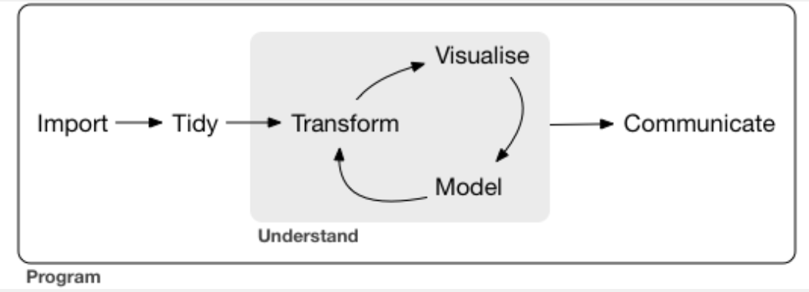
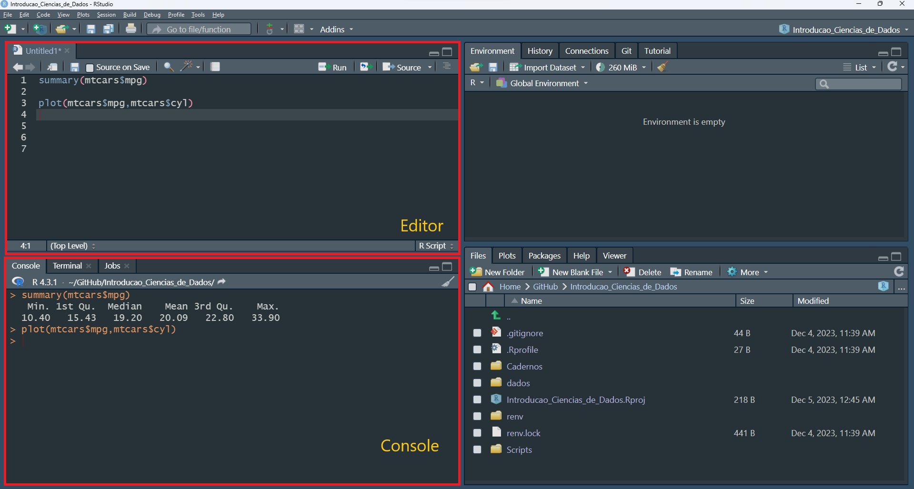
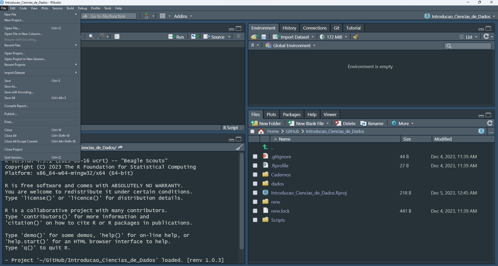
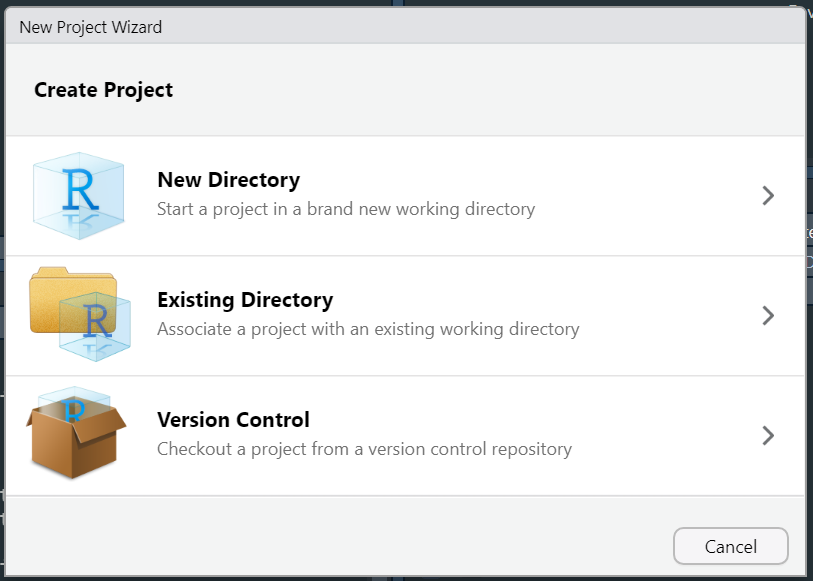
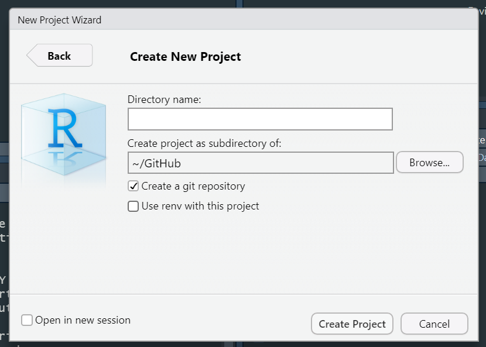

```{r setup, include=FALSE}
knitr::opts_chunk$set(echo = TRUE)
```

Este material é para o cuso de Introdução à Ciência de Dados

## O que é Ciência de dados?

-   De forma geral, a ciência de dados é um campo interdisciplinar que envolve métodos científicos para analisar dados com objetivo de descobrir padrões, tendências, relações e informações úteis que possam ser usadas para tomar decisões.

-   Basicamente, a ciência de dados combina conhecimentos de estatística, matemática e programação.

-   Importante observar que o domínio em assuntos específicos são necessário de acordo com o conjunto de dados analisados.

## Etapas da Ciência de dados

-   **Importar (*Import*)**: Obtenção dos dados armazenados em um arquivo, banco de dados ou *application programming interface (API)* da web e os carrega em um *data frame* por exemplo.

-   **Organizar** **(*Tidy*)**: Tratamento das inconsistências. Mitigar problemas de padronização de nomes, obter as variáveis de interesse e remover casos que estão fora do escopo da análise. O objetivo dessa etapa é a criação da base de dados analítica.

-   **Transformar (*Transform*)**: Criação de novas variáveis e re-categorização de variáveis existentes.

-   **Visualizar (*Visualise*)**: Observar os resultados das transformações em busca de eventuais relações de dependência entre as variáveis

-   **Modelar (*Model*)**: Desenvolver os modelos estatísticos responsáveis por responder às questões de interesse.

-   **Comunicar (*Comunicate*)**: Apresentar os resultados com certa inteligência visual, ou seja, os resultados obtidos são comunicados através de uma série de ferramentas, como relatórios, dashboards interativos ou Application Programming Interfaces (API) para automação.

-   **Programação (*Program*):** Ao redor de todas essas ferramentas está **a programação**. A programação é uma ferramenta transversal que você usa em todas as partes do projeto.

    {alt="Ciclo da Ciência de Dados" width="400"}

-   *Observação*: Geralmente, o processo de coleta, organização e transformação dos dados é denominado de ***Data wrangling***. Nesse caso, o processo de *Data wrangling* é crucial para garantir que os dados estejam em boas condições para análise estatística, modelagem ou visualização.

## Instalação do R e RStudio

-   A seguir é apresentado os passo para instalação do R para o sistema operacional Windows. Para outros sistemas operacionais, clique [[aqui]{.underline}](https://livro.curso-r.com/1-1-instalacao-do-r.html)

-   **Passo a passo de instalação do R para Windows:**

    1.  Acesse o site do CRAN para Windows [[aqui]{.underline}](https://cran.r-project.org/bin/windows/base/)

    2.  Baixe a versão mais recente do R para Windows.

    3.  Execute o instalador e siga as instruções para completar a instalação.

-   **Passo a passo de instalação do RStudio**

-   O **RStudio** é uma IDE (Integrated Development Environment) popular para R que oferece uma interface e ferramentas adicionais:

    1.  Acesse o site de download do RStudio [[aqui]{.underline}](https://www.rstudio.com/products/rstudio/download/)

    2.  Baixe a versão do RStudio Desktop correspondente ao seu sistema operacional.

    3.  Execute o instalador e siga as instruções para completar a instalação.

## Apresentação do RStudio

-   O RStudio é uma interface de desenvolvimento integrada (IDE) popular para a linguagem de programação R.

### Telas

-   Ele oferece várias telas e painéis para facilitar o desenvolvimento, análise de dados e criação de visualizações.



-   Segue uma breve explicação das telas principais do RStudio.

1.  **Console:**

    -   A tela principal onde você digita comandos R e recebe a saída imediata.

2.  **Script Editor:**

    -   Onde você escreve e edita seus scripts em R. Os scripts são arquivos contendo código R que podem ser executados no console.

3.  **Environment/Painel de Ambiente:**

    -   Exibe informações sobre objetos (variáveis, datasets) em sua sessão R atual.

4.  **History/Histórico:**

    -   Mantém um histórico de comandos R previamente executados.

5.  **Files/Painel de Arquivos:**

    -   Mostra os arquivos e diretórios do seu projeto. Facilita a navegação e a organização.

6.  **Plots/Painel de Gráficos:**

    -   Exibe visualizações geradas a partir do R.

7.  **Packages/Pacotes:**

    -   Gerencia pacotes R instalados e fornece ferramentas para instalação e atualização.

8.  **Help/Ajuda:**

    -   Fornece acesso à documentação e ajuda sobre funções e pacotes R.

9.  **Viewer/Visualizador:**

    -   Exibe visualizações mais complexas, como páginas web, no próprio IDE.

10. **Git:**

    -   Facilita a integração com sistemas de controle de versão Git, permitindo o rastreamento de alterações em projetos.

11. **Connections/Conexões:**

    -   Permite conectar-se a fontes de dados externas

12. **Terminal:**

    -   Um terminal embutido para execução de comandos do sistema operacional.

### Cheatsheets

-   As "cheatsheets" (folhas de dicas) no RStudio são recursos visuais e resumidos que fornecem informações rápidas e úteis sobre tópicos específicos relacionados à linguagem de programação R, ao ambiente RStudio e a pacotes específicos do R.

-   Para acessar as cheatsheets, você pode ir diretamente à [[página de cheatsheets do RStudio]{.underline}](https://rstudio.com/resources/cheatsheets/)

-   Também pode ser acessada cliclando em Help -\> Cheat Sheets

## Caminhos e **Diretório de trabalho**

### **Caminhos**

-   Entende-se por **caminho** o endereço do arquivo no computador

-   Existem duas formas de passarmos o caminho de arquivo: **caminho absoluto** ou **caminho relativo**

-   O **caminho absoluto** especifica o local exato de um arquivo desde a raiz do sistema de arquivo

```{r}
getwd()
```

-   Observe que o local de referência é a pasta "*caderno*", pois este é o caminho absoluto para a pasta onde esse aula foi produzida. Vamos voltar para a pasta "*Introducao_Ciencias_de_Dados*" utilizando o conceito de caminho relativo.

-   O **caminho relativo** é especificado em relação ao diretório de trabalho atual ou a outro local de referência. Assim, se você quiser acessar alguma base de dados na pasta "*dados"* partindo da pasta "*caderno",* o caminho seria*:* `../dados/base_de_dados.formato`.

-   Nesse caso, `../` é o comando para voltar uma pasta dentro do caminho.

-   Caso você queira trocar o local referência da pasta "*caderno"* para a pasta "*Introducao_Ciencias_de_Dados*", use o seguinte código:

```{r}
setwd("..") # trocando local referência ou diretório de trabalho
getwd()
```

### **Diretório de trabalho**

-   Basicamente, diretório de trabalho refere-se a uma pasta específica no sistema de arquivos do computador em que um programa está atualmente operando ou onde ele procura por arquivos para ler e salvar por padrão.

-   No contexto do R, o diretório de trabalho é particularmente importante porque é o local onde o R procura por arquivos . Isso significa que, se você carregar ou salvar um arquivo sem especificar a pasta, o R assumirá que o arquivo está no diretório de trabalho.

-   É no diretório de trabalho que o R procura os arquivos que você pede para carregar e onde ele coloca todos os arquivos que você pede para salvar. De forma geral, é o local que está localizada sua análise.

-   RStudio mostra seu diretório de trabalho atual na parte superior do console:

    

-   Você também pode visualizar o diretório de trabalho atual usando a função **`getwd().`**

-   Você também pode definir o diretório de trabalho dentro do R utilizando a

    função `setwd("colocar_o_caminho").`

### **Observações**

-   Caminhos e diretórios são um pouco complicados porque existem dois estilos básicos de caminhos: Mac/Linux e Windows. Existem três maneiras principais pelas quais eles diferem

    1.  Como você separa os componentes do caminho. Mac e Linux usam barras (por exemplo  `plots/diamonds.pdf`) e o Windows usa barras invertidas (por exemplo  `plots\diamonds.pdf`). R pode funcionar com qualquer tipo. Porém barras invertidas significam algo especial para R, e para obter uma única barra invertida no caminho, você precisa digitar duas barras invertidas! Recomendo sempre usar o estilo Linux/Mac com barras.

    2.  Ao criar scripts ou projetos em R, é uma boa prática **usar caminhos relativos**, pois isso torna o código mais portátil e facilita a colaboração. Além disso, evita problemas quando você compartilha seu código com outros ou move seu projeto para um novo sistema operacional.

    3.  A última pequena diferença é o local para onde `~`aponta. `~`é um atalho conveniente para o seu diretório inicial. No Windows, ele aponta para o diretório de documentos.

-   Nesses casos, criar projetos no R é uma prática recomendada e traz vários benefícios para a organização, colaboração e reprodutibilidade do trabalho

## Projetos

-   Projetos no RStudio são uma maneira organizada e estruturada de trabalhar em análises de dados e programação em R ou em qualquer linguagem de programação suportada pelo RStudio.

-   Aqui estão algumas razões pelas quais criar projetos no RStudio é importante:

    1.  **Organização Estruturada:**

        -   Projetos fornecem uma estrutura organizada para seus arquivos, dados e scripts. Isso facilita a navegação e a localização de recursos específicos relacionados ao projeto.

    2.  **Reprodutibilidade:**

        -   Ao criar um projeto, você organiza seu trabalho de forma que seja mais fácil reproduzir suas análises. Outros usuários podem reproduzir facilmente os resultados, garantindo a reprodutibilidade do trabalho.

    3.  **Configuração do Diretório de Trabalho:**

        -   O projeto define automaticamente o diretório de trabalho, eliminando a necessidade de definir caminhos relativos em seus scripts. Isso reduz erros e torna o código mais portátil.

    4.  **Controle de Versão:**

        -   Projetos podem ser vinculados a sistemas de controle de versão, como o Git. Isso facilita o controle de alterações em seus scripts e colaboração em equipes.

    5.  **Ambiente Isolado:**

        -   Projetos têm seu próprio ambiente no RStudio. Isso significa que as bibliotecas (pacotes) e as configurações específicas do projeto não interferem em outros projetos ou em seu ambiente global.

-   A seguir são apresentados alguns passo para criar um projeto no RStudio.

-   **Passo 1**: Abra o RStudio

    -   Inicie o RStudio em seu computador.

-   **Passo 2**: Crie um Novo Projeto

    -   No canto superior direito do RStudio, clique em "File" (Arquivo) e selecione "New Project" (Novo Projeto).



-   **Passo 3**: Escolha o Tipo de Projeto

    1.  New Directory (Novo Diretório): Cria um novo diretório para o projeto.

    2.  Existing Directory (Diretório Existente): Usa um diretório existente como projeto.

{width="500"}

-   **Passo 4**: Escolha um Modelo

    -   Você pode escolher um modelo específico se estiver disponível. Caso contrário, escolha "New Project" (Novo Projeto).

{width="500"}

-   **Passo 5**: Nomeie e Localize o Projeto

    -   Dê um nome ao seu projeto e escolha o local onde o diretório do projeto será armazenado.

{width="500"}

-   **Passo 6**: Clique em "Create Project"

    -   Clique em "Create Project" (Criar Projeto) para finalizar a criação do projeto.

-   Após criar o projeto, você verá a estrutura do diretório do projeto no painel inferior direito do RStudio.

-   Organize seus Arquivos. Dentro do diretório do projeto, você pode criar subdiretórios (por exemplo, "data", "scripts", "reports") para organizar seus arquivos.

-   Tudo o que você precisa está em um só lugar e bem separado de todos os outros projetos nos quais você está trabalhando.

## Fluxo de Trabalho

-   Aqui será apresentado um fluxo de trabalho básico que pode incrementado no decorrer do curso.

1.  **Organize o Projeto:**

    -   Mantenha um diretório de projeto bem estruturado.

    -   Use subdiretórios para dados brutos, scripts, figuras e relatórios.

2.  **Documente Seu Código:**

    -   Adicione comentários claros e informativos ao seu código.

    -   Use R Markdown ou Notebooks R para incorporar narrativa junto com o código.

3.  **Versione Seu Código:**

    -   Use um sistema de controle de versão como o Git para controlar as mudanças no seu código.

    -   Inclua um arquivo **`.gitignore`** para evitar a inclusão de arquivos desnecessários no repositório.

4.  **Compartilhe Seu Código e Dados:**

    -   Disponibilize seu código e dados em um repositório público (por exemplo, GitHub) ou em um formato acessível.

## Atividade

1.  Crie uma conta no [[Github]{.underline}](https://github.com/)

2.  Faça donwload do [[Git]{.underline}](https://git-scm.com/)

3.  Crie um projeto com o nome: ICD_SeuNome

4.  Irei mostrar na próxima aula como fazer a integração do projeto ICD_SeuNome e Git. Porém, tentem fazer. Pesquisem
