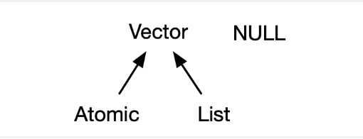
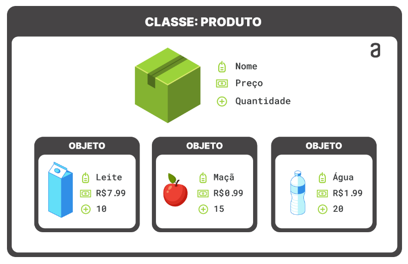

<!-- ```{r, echo=FALSE} -->

<!-- htmltools::img(src = knitr::image_uri("C:/Users/Leonardo_Nascimento/Documents/GitHub/Introducao_Ciencias_de_Dados/Cadernos/Figuras/DE.jpg"),  -->

<!--                alt = 'logo',  -->

<!--                 width = 180, height = 180, -->

<!--                style = 'position:absolute; top:10px; right:400px; padding:10px;') -->

<!-- ``` -->

<!-- ```{r, echo=FALSE} -->

<!-- htmltools::img(src = knitr::image_uri("C:/Users/Leonardo_Nascimento/Documents/GitHub/Introducao_Ciencias_de_Dados/Cadernos/Figuras/ufam.png"),  -->

<!--                alt = 'logo',  -->

<!--                width = 180, height = 180, -->

<!--                style = 'position:absolute; top:10px; left:400px; padding:10px; "margin: -100px;') -->

<!-- ``` -->

```{css, echo=FALSE}
.watch-out {
  border: 3px solid gray;
  font-weight: bold;
}

```

```{r setup, include = FALSE}
knitr::opts_chunk$set(
  collapse = TRUE,
  comment  = "#>",
  class.source = "watch-out",
  fig.height = 3, 
  fig.width = 3, 
  fig.align = "center"
)
```

-   No contexto da linguagem de programação R, objetos e vetores são conceitos fundamentais relacionados à manipulação de dados;

# Objetos

-   Um objeto é simplesmente um **nome** que guarda um valor;

-   O R permite salvar valores dentro de um **objeto**

-   Para criar um objeto, escolha um **nome** e use `<-` ou `=` para guardar a informação dentro do objeto

-   Considere os exemplos abaixo

```{r}
a <- 2
a = 2
print(a)
```

```{r}
b <- 1:6
print(b)
```

-   Observação: quando o objeto for criado, ele aparecerá no painel *Environment*

-   Ao escolher nomes para objetos em R, é importante seguir algumas regras e boas práticas para garantir a clareza, consistência e evitar conflitos com palavras reservadas.

-   Aqui estão algumas restrições para nomear objetos em R:

    -   **Sintaxe básica:**

        -   Os nomes de objetos devem começar com uma letra.

        -   Podem conter letras, números e pontos (.), mas **não podem começar com um número ou conter espaços**.

        -   Evite o uso de caracteres especiais, como \@, \$, %, &, etc.

    -   **Palavras reservadas:**

        -   Evite usar nomes que são palavras reservadas em R, pois isso pode causar conflitos. Alguns exemplos de palavras reservadas incluem **`if`**, **`else`**, **`while`**, **`function`**, **`for`**, **`in`**, **`TRUE`**, **`FALSE`**, entre outras.

    -   **Observação**:

        -   O R **diferencia letras maiúsculas e minúsculas**, isto é, `a` é considerado um objeto diferente de `A`

        -   Escolha nomes descritivos que forneçam informações sobre o propósito ou conteúdo do objeto.

        -   No R, uma base de dados é representada por objetos chamados de *data frames*

        -   Exemplos de nomes aceitáveis: `idade`, `nomeVariavel`, `meuVetor`, `resultado_final` e `dados_do_paciente`

# Vetores

-   Um vetor é uma estrutura de dados unidimensional que pode conter ou não elementos de um único tipo

-   Os vetores podem ser subdivididos em : **vetores atômicos** e **listas**

-   Eles diferem quanto aos tipos de seus elementos:

    -   para **vetores atômicos**, todos os elementos devem ter o mesmo tipo; 

    -   **para listas**, os elementos podem ter tipos diferentes.

-   Os elementos de um vetor são acessados por índices.

{width="437"}

## Vetores atômicos

-   Existem quatro tipos principais de vetores atômicos: lógico, inteiro, *double* e caractere (que contém strings);

-   Vetores inteiros e *double* são conhecidos como vetores numéricos;

<!-- -->

-   Para criar vetores use a função `c()` (*combine*)

-   Para saber o tipo de vetor, você pode utilizar a funcão `typeof()`. Para saber seu comprimento a função `length()`.

-   Você pode **testar** se um vetor é de um determinado tipo com uma função `is.*()`

### Lógico

```{r}
lgl_var <- c(TRUE, FALSE)# lógico
lgl_var <- c(T, F)# lógico
typeof(lgl_var)# verificar o tipo
is.logical(lgl_var) # testar se o vetor é do tipo lógico
is.integer(lgl_var)
length(lgl_var)
```

### Double

```{r}
dbl_var <- c(1, 2.5, 4.5)#forma decimal 
dbl_var <- c(1.23e4)##forma científica 
typeof(dbl_var) 
is.double(dbl_var) # testar se o vetor é do tipo Double 
is.character(lgl_var)
length(dbl_var)
```

-   Existem três valores especiais exclusivos para Double: Inf, -Inf e NaN (Not a Number)

```{r}
dbl_var <- c(Inf,-Inf,NaN)
typeof(dbl_var)
```

### Inteiro

-   Os inteiros são escritos de forma semelhante aos Double, mas devem ser seguidos por L

```{r}
int_var <- c(1L, 6L, 10L)# inteiro
typeof(int_var)
is.integer(int_var)
is.character(int_var)
length(int_var)
```

### Caractere (string)

-   As strings são colocados entre " "

```{r}
chr_var <- c("Leonardo", "Nascimento")
chr_var <- c("Ótimo", "Bom","Ruim")
chr_var <- c("Masculino", "Feminino")
is.character(chr_var)
typeof(chr_var)
```

### Observações

-   Em um vetor, cada valor ocupa uma posição específica determinada pela ordem em que os elementos foram adicionados durante a criação do vetor.

-   Essa ordem é crucial para acessar cada valor de maneira individual dentro do vetor.

```{r}
meu_vetor = c(1,2,10,4,5)
meu_vetor[3]
```

#### NULL

-   Embora não seja um vetor, `NULL`está intimamente relacionado aos vetores e geralmente desempenha a função de um vetor genérico de comprimento zero.

```{r}
vetor_null <- c(NULL)
vetor_null
typeof(vetor_null)
```

#### NA

-   Em R, "NA" (*Not Available*) é usado para representar valores ausentes ou desconhecidos.

-   A maioria dos cálculos envolvendo um valor faltante retornará outro valor faltante.

```{r}
meu_vetor <- c(10,NA)
2*meu_vetor
```

-   Para verificar se um valor é "NA", você pode usar a função **`is.na()`**.

```{r}
x <- c(1, 2,3,NA, 5)
is.na(x)

```

-   Muitas funções em R têm maneiras para lidar com valores ausentes. Por exemplo, algumas funções têm argumentos como **`na.rm`** para remover NAs durante cálculos

```{r}
notas_alunos <- c(10, 7, NA, 8, 8.5)
mean(notas_alunos, na.rm = TRUE) # média
```

-   Você pode substituir valores NA por outros valores usando a função **`is.na()`** e indexação

```{r}
meu_vetor <- c(1, 2,3, 4, NA)
meu_vetor[is.na(meu_vetor)] <- 0
```

### Coerção

-   Para vetores atômicos, o tipo é uma propriedade de todo o vetor

-   Todos os elementos devem ser do mesmo tipo.

-   Quando você tenta combinar tipos diferentes, eles serão forçados em uma ordem fixa: caractere → double → inteiro → lógico.

```{r}
y1 <- c(1L,"leonardo") # inteiro, character
y1
typeof(y1)

y2 <- c(5.5,10L) # double, inteiro
y2
typeof(y2)
```

## Listas

-   As listas são um avanço em complexidade em relação aos vetores atômicos: cada elemento pode ser de qualquer tipo

-   Você constrói listas com a função `list()`

```{r}
l1 <- list(
  1:3, 
  "a", 
  c(TRUE, FALSE, TRUE), 
  c(2.3, 5.9)
)
print(l1)
typeof(l1)

```

-   Para acessa um elemento da lista usamos `[[ ]]`

```{r}
l1 <- list(
  1:3, 
  "a", 
  c(TRUE, FALSE, TRUE), 
  c(2.3, 5.9)
)
l1[[4]]
l1[[4]][1]
```

-   Você pode testar uma lista com `is.list()` e forçar uma lista com `as.list()`

```{r}
minha_lista = list(1:3)
print(minha_lista)
is.list(minha_lista)
vec <- c(1,2,3)
is.list(vec)
as.list(vec)

```

Você pode transformar uma lista em um vetor atômico com `unlist()`.

```{r}
minha_lista = list(1:3,4:10)
print(minha_lista)
unlist(minha_lista)
```

-   As regras para o tipo resultante são complexas, não estão bem documentadas e nem sempre são equivalentes ao que você obteria com `c().`

# Matrizes

-   Uma matriz em R é uma estrutura bidimensional que pode armazenar dados de um único tipo.

-   Isso significa que todos os elementos de uma matriz devem ser do mesmo tipo, como números inteiros, *double* ou caracteres.

-   Você pode criar uma matriz usando a função **`matrix()`**. Especifique os dados e o número de linhas e colunas.

```{r}
# Criando uma matriz 2x2
vec1 = c(1,2)
vec2 = c(3,4)
minha_matriz <- matrix(c(vec1,vec2), nrow = 2, ncol = 2)
minha_matriz
is.matrix(minha_matriz)
```

```{r}
vec1 = c(1,2)
vec2 = c(3,4)
minha_matriz <- matrix(c(vec1,vec2), nrow = 2, ncol = 2,byrow = T)
minha_matriz
dim(minha_matriz)
ncol(minha_matriz)
nrow(minha_matriz)
```

-   Os elementos de uma matriz podem ser acessados usando índices de linha e coluna.

```{r}
minha_matriz[1,2] # Acessando o elemento na primeira linha e segunda coluna
```

# Array

-   Um array em R é uma estrutura de dados multidimensional que pode conter elementos de um único tipo. Diferentemente das matrizes, os arrays podem ter mais de duas dimensões.

-   Você pode criar um array usando a função **`array()`**. Especifique os dados e as dimensões.

```{r}
# Criando um array 2x3x2 - linhas X colunas X camadas
vec1 = c(1L,2L,3L,4L)
vec2 = c(5L,6L,7L,8L)
vec2 = c(5L,6L,7L,8L)
meu_array <- array(c(vec1,vec2), dim = c(2,2,3))
meu_array
typeof(meu_array)
```

-   Os elementos de um array são acessados usando índices correspondentes às dimensões.

```{r}
meu_array[1,2,2]# linhas X colunas X camadas
meu_array[,,1] # acessando a matriz da primeira camada
meu_array[,,2]# acessando a matriz da segunda camada
```

# Data frame

-   No R, um data frame é uma estrutura de dados bidimensional semelhante a uma tabela em um banco de dados relacional ou a uma planilha.

-   Cada coluna em um data frame pode conter dados de diferentes tipos, tornando-os especialmente úteis para representar conjuntos de dados complexos.

-   Você pode criar um data frame manualmente usando a função **`data.frame()`**.

```{r}
meu_data_frame <- data.frame(
  Nome = c("Alice","Leo","Vitor"),
  Idade = c(25,30,22),
  Nota = c(85, 92, 78)
)
meu_data_frame
```

```{r}
dados_climaticos <- data.frame(
  Dia = seq(from = as.Date("2023-01-01"), by = "days", length.out = 5),
  Temperatura = c(25.3, 24.5, 22.0, 26.8, 23.5),
  Umidade = c(65, 70, 75, 60, 80),
  VelocidadeVento = c(10, 12, 8, 15, 9)
)

# Exibindo o data frame
print(dados_climaticos)
head(dados_climaticos,3)
```

-   Você pode acessar uma coluna específica usando o nome da coluna.

-   Você também pode acessar elementos por índices de linha e coluna

```{r}
dados_climaticos$Temperatura
dados_climaticos[,2]
```

# Atributos

-   Além dos próprios elementos, os vetores podem ter atributos que fornecem informações adicionais sobre os dados

{width="604"}

## Nomes

-   Você pode atribuir nomes a cada elemento do vetor usando a função **`names()`**. Isso facilita a referência a elementos específicos pelo nome.

```{r}
meu_vetor <- c(1, 2, 3)
names(meu_vetor) <- c("primeiro", "segundo", "terceiro")
meu_vetor
attributes(meu_vetor)
```

-   Formas alternativas para nomear um vetor

```{r}
x1 <- c(a = 1, b = 2, c = 3)
x1

x2 <- setNames(1:3, c("a", "b", "c"))
x2
```

## Dimensão

-   Em R, vetores podem ter atributos de dimensão, que são comumente associados a matrizes.

```{r}
meu_vetor <- 1:5
meu_vetor
dim(meu_vetor) <- c(5, 1) # linha x coluna
meu_vetor
attributes(meu_vetor)
```

## Classe

-   A classe de um objeto é uma propriedade que indica a natureza ou tipo do objeto em termos de programação orientada a objetos

-   A classe é uma parte fundamental em R, pois determina como o objeto será tratado em operações específicas e quais métodos (funções associadas) podem ser aplicados a ele.

-   Aqui estão algumas das classes mais comuns em R:

    1.  **numeric:** Números reais (*double*).

    2.  **integer:** Números inteiros.

    3.  **logical:** Valores lógicos (TRUE ou FALSE).

    4.  **character:** Strings de caracteres.

    5.  **factor:** Fatores, usados para representar variáveis categóricas com níveis

    6.  **Date:** Representação de datas.

    7.  **POSIXct e POSIXlt:** Representação de datas e horas.

    8.  **data.frame:** Uma estrutura bidimensional que pode conter colunas de diferentes classes.

    9.  **matrix:** Uma estrutura bidimensional que contém elementos de uma única classe.

    10. **array:** Uma estrutura de dados multidimensional que pode conter elementos de uma única classe.

    11. **list:** Uma estrutura que pode conter elementos de diferentes classes e até outras listas.

    12. **function:** Funções.

-   Em R, a função **`class()`** é usada para obter a classe de um objeto

```{r}
vec1 = c(1,2)
vec2 = c(3,4)
class(vec1)
minha_matriz <- matrix(c(vec1,vec2), nrow = 2, ncol = 2)
minha_matriz
class(minha_matriz)
```

-   Você pode atribuir uma classe a um vetor usando a função **`class()`**. Isso é comumente usado em programação orientada a objetos em R.

```{r}
vec <- c(1,2,3,4)
class(vec)
class(vec)<- "minha_classe"
class(vec)

```

## Exemplo

-   Criando um objeto da classe Pessoa

```{r}

pessoa1 <- structure(
  c("Leonardo"), 
  idade = 31,
  last_name = "Nascimento",
  class = "Pessoa",
  names = c("nome_pessoa")
)
pessoa1
class(pessoa1)
attr(pessoa1,"idade") # selecionado o atributo idade
names(pessoa1)
```

# Importação/Exportação de dados

-   Em R, você pode usar várias funções para importar e exportar dados em diferentes formatos, incluindo CSV, TXT e RDS. Abaixo estão exemplos de como realizar essas operações.

## .CSV

-   Importação

```{r}
dados_sexo_curso <- read.csv("~/GitHub/Introducao_Ciencias_de_Dados/dados/tab_sexo_curso.csv")
head(dados_sexo_curso)
```

-   Exportação

```{r}
exemplo_csv = data.frame(Pessoa = c("Leo","Lennon"),Idade=c(30,29))
write.csv(exemplo_csv ,"~/GitHub/Introducao_Ciencias_de_Dados/dados/exemplo_csv.csv")
```

## .TXT

-   Importação

```{r}
dados_temperatura <- read.table("~/GitHub/Introducao_Ciencias_de_Dados/dados/temperatura.txt") 
head(dados_temperatura)
```

-   Exportação

```{r}
exemplo_txt = data.frame(Pessoa = c("Leo","Lennon"),Idade=c(30,29)) 
write.table(exemplo_txt ,"~/GitHub/Introducao_Ciencias_de_Dados/dados/exemplo_txt.txt")
```

## .RDS

-   Importação

```{r}
dados <- readRDS("~/GitHub/Introducao_Ciencias_de_Dados/dados/tempo_exercicio_perda_peso.rds") 
head(dados)
```

-   Exportação

```{r}
exemplo_rds = data.frame(Pessoa = c("Leo","Lennon"),Idade=c(30,29))  
saveRDS(exemplo_rds ,"~/GitHub/Introducao_Ciencias_de_Dados/dados/exemplo_rds.rds")
```

## Observações

1.  **Separadores e Delimitadores:**

    -   Certifique-se de usar o argumento **`sep`** para especificar o separador ou delimitador correto, dependendo do formato do seu arquivo (vírgula, ponto e vírgula, tabulação, etc.).

2.  **Encodings:**

    -   Se você estiver trabalhando com arquivos que contêm caracteres especiais, pode ser necessário especificar o encoding usando o argumento **`fileEncoding`**.

3.  **Cabeçalho:**

    -   Utilize o argumento **`header`** para indicar se o arquivo contém um cabeçalho ou não (**`header = TRUE`** para sim, **`header = FALSE`** para não).

4.  **Path:**

    -   Se estiver usando caminhos no Windows, pode ser necessário usar barras invertidas duplas (**`\\`**) ou uma única barra invertida (**`\`**) para especificar o caminho.

<!-- # Atividades -->

<!-- -   [01-criacao_classes.R](https://github.com/leonardobfn/Introducao_Ciencias_de_Dados/blob/master/Atividades/01-criacao_classes.R) -->

<!-- -   [02-atributos_data_frames.R](https://github.com/leonardobfn/Introducao_Ciencias_de_Dados/blob/master/Atividades/02-atributos_data_frames.R) -->

# Referências

-   [[Advanced R]{.underline}](https://adv-r.hadley.nz/index.html)

-   [[R for Data Science]{.underline}](https://r4ds.had.co.nz/index.html)

-   [Hands-On Programming with R](https://web.itu.edu.tr/~tokerem/Hands-On_R.pdf)